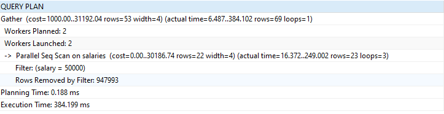
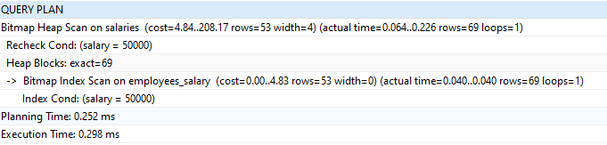

## Indexing

1. Indexing is a process to apply the index to the one or more column in a table in database. 
2. Index in database like index in a dictionary where we can search a word by its initial letter. For example, when we want to search word 'Mangoo', we only search M index and search it easily. We don't need to search the word 'Mangoo' from first page of dictionary.  
3. Indexing is one of solutions to increase query execution perfomance, especially `SELECT` query which gives result more table.
4. There are some things that can affect the query execution performance : 
    - The amount of data (the row data in a table and the table)
    - The number of data transafer at the same time
    - Query length 
5. Indexing usually applied on column that contains which the data is often searched by the user
6. Indexing will help database performance to give response quickly when our app handle multiple request in the same time.
7. The difference query execution time using 2.8 million row of data explain in 2 screenshot below 
    - Query time execution without apply the index
    
    - Query time execution with apply index column 
    

8. Hopefully this readme help you. Advice from reader will help the writer to improve this readme int the future 

9. Acknowledgement: 
    - [Github - Data Repository](https://github.com/datacharmer/test_db/)
    - [Free Code Camp - Database Indexing](https://www.freecodecamp.org/news/database-indexing-at-a-glance-bb50809d48bd/)
    - [Medium - SQL Query Performance](https://medium.com/@gwynngroupinc/sql-query-performance-2482bb04aa69)
    - [Solarwinds - How to Fix Slow Queries](https://orangematter.solarwinds.com/2018/01/17/slow-queries-move-fast-to-fix-them/)
    - [SQL Hack - Poor SQL Query](https://www.sqlshack.com/poor-sql-query-design-sql-query-performance-killer-basics/)
    - [Youtube - Indexing Explained with PostgreSQL](https://www.youtube.com/watch?v=-qNSXK7s7_w)

